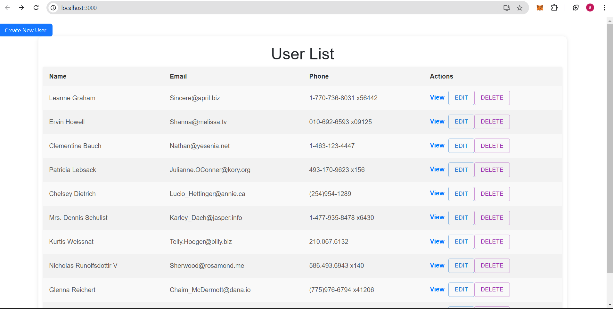
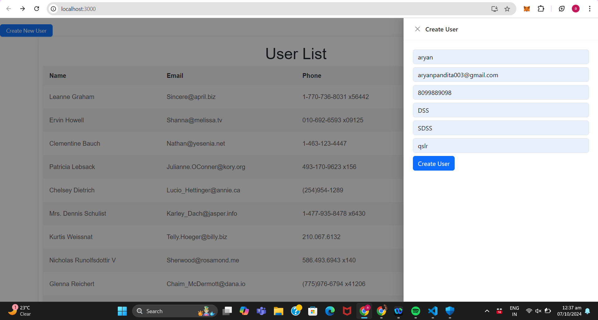
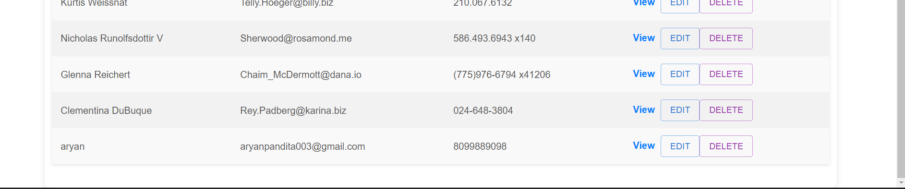
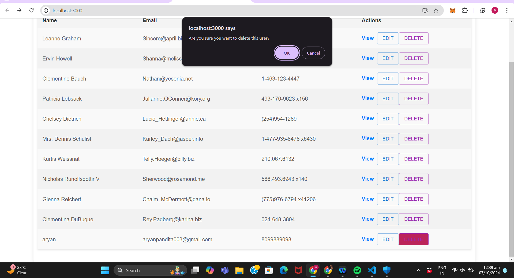
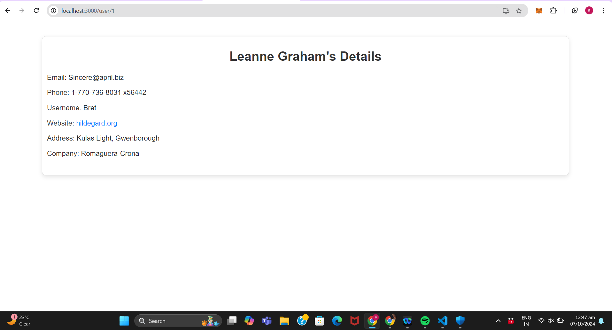

# User Management Application

This is a simple **User Management Application** built with React. The application demonstrates basic CRUD (Create, Read, Update, Delete) functionalities, allowing users to be fetched, added, updated, and deleted. It uses the **JSONPlaceholder API** to simulate backend operations.

## Features

- **Fetch Users**: The application fetches and displays a list of users from the JSONPlaceholder API.
- **Create User**: Users can be created through a form, displayed in a modal or drawer, with validations.
- **Edit User**: Users can be edited via a modal or drawer with the form pre-filled.
- **Delete User**: Users can be deleted with a confirmation prompt.
- **Responsive Design**: The app is fully responsive, working seamlessly on both desktop and mobile devices.
- **Loading Spinner**: A loading spinner is shown while data is being fetched from the API.
- **Form Validations**: Appropriate validation messages are shown for each field in the forms.

## Screenshots

 
 
 
 
 
 

## Technologies Used

- **React**: Core frontend library.
- **React Hooks**: For managing state and lifecycle (e.g., `useState`, `useEffect`).
- **React Router**: For navigation and routing.
- **CSS**: For custom styling of components.
- **JSONPlaceholder API**: Used as a mock backend to fetch and modify user data.

## Installation

To get started with this project, follow the steps below:

### 1. Clone the Repository
```bash
git clone https://github.com/your-username/user-management.git
```

### 2. Navigate to the Project Directory
```bash
cd user-management
```

### 3. Install Dependencies
Install the required dependencies using npm (or yarn):
```bash
npm install
```

### 4. Start the Application
Run the application locally:
```bash
npm start
```

The application will be available at `http://localhost:3000`.

## Usage

- **Home Page**: Displays a list of users fetched from the JSONPlaceholder API.
- **Create User**: Click on the "Create User" button, and a modal/drawer will appear where you can add a new user.
- **Edit User**: Click on the "Edit" button next to a user, and a modal/drawer will appear to update the user details.
- **Delete User**: Click on the "Delete" button next to a user, and a confirmation prompt will appear before deletion.

  
## Folder Structure

```bash
├── public
│   └── index.html           # The main HTML file
├── src
│   ├── components
│   │   ├── Home.js          # Main component to display user list
│   │   │── UserDetail.js     # Detailing 
│   │   ├── CreateUser.js # Component for creating a user in a drawer
│   │   ├── EditUser.js   # Component for editing a user in a drawer
│   │   └── Spinner.js       # Loading spinner component
│   ├── App.js               # Main application component
│   ├── App.css              # Global styles
│   └── index.js             # Entry point of the React application
└── package.json             # Project dependencies and scripts
```

## Validations

- **Name**: Minimum 3 characters.
- **Email**: Must be a valid email format.
- **Phone**: Must be a valid phone number.
- **Username**: Auto-filled (e.g., "USER-name") and non-editable.
- **Address (Street, City)**: Required fields.
- **Company Name**: Optional, but if provided, must be at least 3 characters.
- **Website**: Optional, must be a valid URL if provided.

## API Integration

This application integrates with the **JSONPlaceholder API** for simulating CRUD operations.

- **Fetch Users**: `GET https://jsonplaceholder.typicode.com/users`
- **Create User**: `POST https://jsonplaceholder.typicode.com/users`
- **Update User**: `PUT https://jsonplaceholder.typicode.com/users/:id`
- **Delete User**: `DELETE https://jsonplaceholder.typicode.com/users/:id`

## Deployment

You can deploy this application using services like **Vercel**, **Netlify**, or **GitHub Pages**.

### Example Deployment Steps (Using Netlify):

1. Push the code to your GitHub repository.
2. Go to [Netlify](https://www.netlify.com/) and sign in.
3. Click **"New Site from Git"** and connect your GitHub repo.
4. Select the repo and start the deployment.

## Optional Advanced Features (Planned)

- **Search Functionality**: A search bar to filter users.
- **Pagination**: Implementing pagination to handle large datasets.
- **TypeScript**: Refactor the app to use TypeScript for better type safety.


